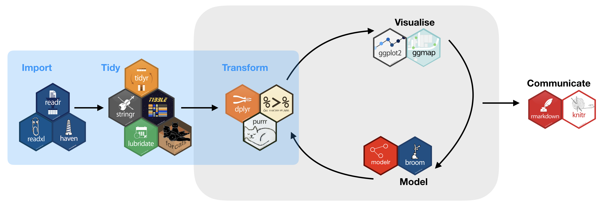

```{r setup, include=FALSE}
knitr::opts_chunk$set(echo = TRUE)
```

<style>
<!-- /* On screens that are 768px or more show the background image on the left*/ -->
@media screen and (min-width: 768px) {
body {
  background-image: url("img_site/satellite_great_barrier_reef_2_2.jpg");
    background-repeat: no-repeat;
    background-attachment: fixed;
    background-position: left;
    background-size: 25% 100%;
  }
}
</style>


## Kurs-Übersicht

In diesem Semester werden wir uns mit folgenden Themen beschäftigen:

- Einstieg in R, Überblick über die Funktionen (Basis und Zusatzpakete) und die Benutzeroberfläche
- Datenstrukturen und Datentypen
- Datenimport und -export
- Datenmanagement und Bereinigen von Daten
- Grafische Auswertungen mit R

In 3 Fallbeispielen werdet Ihr dann die Gelegenheit haben, das Erlernte wiederholt anzuwenden.

<br>


<br>

Dieser Kurs basiert stark auf dem sog. **tidyverse framework** und stellt verschiedene R Pakete vor, die einem R Syntax Dialekt folgen welche den Datenimport, die Datenverarbeitung und die Datenvisualiserung vereinfacht.

<br>
<br>

## Lektionen

Es gibt insgesamt 8 Lektionen die die Themenkomplexe **Programmierung in R**, **Datenexploration & Visualisierung** umfassen. Jede der Lektionen enthält interaktive Quizze und Aufgaben (die nur im Webbrowser funktionieren, nicht in den PDF Dateien).

Folgende keyboard shortcuts können während der einzelnen Lektionspräsentationen genutzt werden:


<kbd>o</kbd> führt in den Übersichtsmodus overview mode

<kbd>w</kbd> führt in den widescreen Modus

<kbd>f</kbd> führt in ddie Vollansicht

<kbd>h</kbd> ermöglicht den code highlight Modus

<kbd>control</kbd> (Windows) or <kbd>command</kbd> (Mac) AND <kbd>+</kbd> / <kbd>-</kbd> um rein oder raus zu zoomen<br>

<kbd>p</kbd> öffnet ein Dialogfenster für weitere Informationen (funktioniert nicht in Safari).

Mit <kbd>esc</kbd> wird der aktuelle Modus beendet.

<br>
<br>

## Kursleitung

Prof. Dr. Christian Möllmann, Dr. Saskia Otto
<br>
mit Unterstützung von Rene Plonus

<br>
<br>


## Zeitplan (Gruppe A)

KW | Zeit | Thema
----|-------------|-----------
14  | Di 9:00-11:00 | Lektion 1 - Einführung in R, RStudio und R Skripte
15 | Di 9:00-11:00 | Lektion 2 - Datenstrukturen
16  | Di 9:00-11:00 | Lektion 3 - Arbeitsbereich und Operatoren
17  | Di 9:00-11:00 | Lektion 4 - Visualisierung in R
18  | Di 9:00-11:00 | Lektion 5 - R Pakete und Data wrangling - 1.Import
19  | Di 9:00-11:00  | Lektion 6 - Data wrangling - 2.Tidy Daten
20  | Di 9:00-11:00  | Lektion 7 - Data wrangling - 3.Transformation
21  | Di 9:00-11:00  | Lektion 8 - Grafiken mit ggplot2
22  | Di 9:00-11:00  | Fallstudie 1
25  | Di 9:00-11:00  | Fallstudie 2
27  | Di 9:00-11:00  | Fallstudie 3
28  | Di 9:00-11:00  | Abschlussbesprechung
