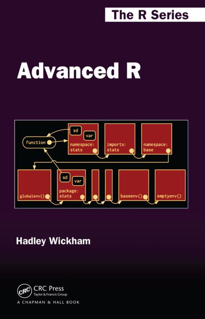

```{r, include=FALSE}
knitr::opts_chunk$set(tidy=FALSE, warning=FALSE, message=FALSE, cache=FALSE, dev.args=list(bg="transparent"), fig.retina = 2)
```

<br>

## Nützliche Websites

#### Allgemein

- [RStudio Cheatsheets](https://www.rstudio.com/resources/cheatsheets/) → gut gemachte Übersichten der Funktionen in den tidyverse Paketen auf 1-2 Seiten
- [R-bloggers](https://www.r-bloggers.com/) → ein Blog mit Neuigkeiten zu den aktuellsten R Entwicklungen und Paketen sowie versch. online tutorials. 
- [DataCamp](https://www.datacamp.com/) → diese Website bietet mittlerweile eine große Bandbreite an R Kursen an, teilweise umsonst sind.
- Um mehr zu R Operatoren zu lesen ist folgendes online tutorial pauf der tutorialcart website empfehlenswert:[ https://www.tutorialkart.com/r-tutorial/r-operators/](https://www.tutorialkart.com/r-tutorial/r-operators/).


#### Visualisierung (v.a. zu ggplot2)

- ggplot2 Dokumentation
    - http://ggplot2.org 
    - http://ggplot2.tidyverse.org
- Hilfe erhält man unter: [ggplot2 mailing list](https://groups.google.com/forum/?fromgroups#!forum/ggplot2)
- Ein Überblick aller geom_functions: http://ggplot2.tidyverse.org/reference/
- Für einen Überblick an den ggplot theme Komponenten empfiehlt sich [Winston Chang's wiki](https://github.com/wch/ggplot2/wiki/New-theme-system) auf github
- Überblick zu ggplot2 Erweiterungen: http://www.ggplot2-exts.org
- Farbschemen zu ColorBrewer insbesondere für Karten: http://colorbrewer2.org
- Das Stowers Institut hat im [ColorChart pdf](http://research.stowers.org/mcm/efg/R/Color/Chart/ColorChart.pdf) eine Liste aller möglichen Farben zusammengestellt, welche sehr hilfreich ist.


#### R Kurs auf Deutsch

Im Rahmen des [Lehrlabors](https://www.universitaetskolleg.uni-hamburg.de/universitaetskolleg-2-0/lehrlabor.html) der Universität Hamburg gibt es das Projekt [R-lab 2.0](https://rlab.blogs.uni-hamburg.de) welches Online Tutorials zu R in den Umweltwissenschaften mittels *swirl* anbietet. Auch das Institut für Marine Ökosystem und Fischereiwissenschaft ist an dem Projekt beteiligt und hat einen begleitenden *swirl* Kurs zu diesem B-MARSYS 6 (Statistik und Programmierung mit R) Kurs konzipiert: [https://rlab.blogs.uni-hamburg.de/rlab-kurse/](https://rlab.blogs.uni-hamburg.de/rlab-kurse/)

<br>
<br>

## Nützliche Bücher

#### Allgemein


- Hadley Wickham & Garret Grolemund (2017): **R for Data Science**, O'Reilly Media Inc., CA, U.S.A, 494p. Online accessible at [http://r4ds.had.co.nz/](http://r4ds.had.co.nz/)<br>
→ <small>Dieses Buch deckt so ziemlich diesen Kurs ab und stellt DAS tidyverse Nachschlagewerk dar. Man kann es als Druck kaufen oder online (dann umsonst) lesen.</small>

<br><br><br><br>

#### Visualisierung (ggplots) 


-  Hadley Wickham (2016): **ggplot2 - Elegant Graphics for Data Analysis**, 2nd edition, Springer International Publishing, Switzerland, 260p. Der Code and Text zu dem Buch kann auch von github runtergeladen werden: [https://github.com/hadley/ggplot2-book](https://github.com/hadley/ggplot2-book)

<br><br><br><br><br><br>


- Alboukadel Kassambara (2013): [Guide to Create Beautiful Graphics in R](http://www.sthda.com/english/download/3-ebooks/5-guide-to-create-beautiful-graphics-in-r-book/), 2nd edition, STHDA, 237p.

<br><br><br><br><br>


#### Programmierung in R



- Hadley Wickham (2014): **Advanced R**, Chapman & Hall/CRC The R Series, UK, 456p. Online verfügbar auf: [http://adv-r.had.co.nz](http://adv-r.had.co.nz).<br>
→ <small>Falls Du noch nicht genug bekommen hast von R und richtig in die Programmierwelt eintauchen wills, dann lohnt sich dieses Buch!</small>

<br><br><br><br><br>
